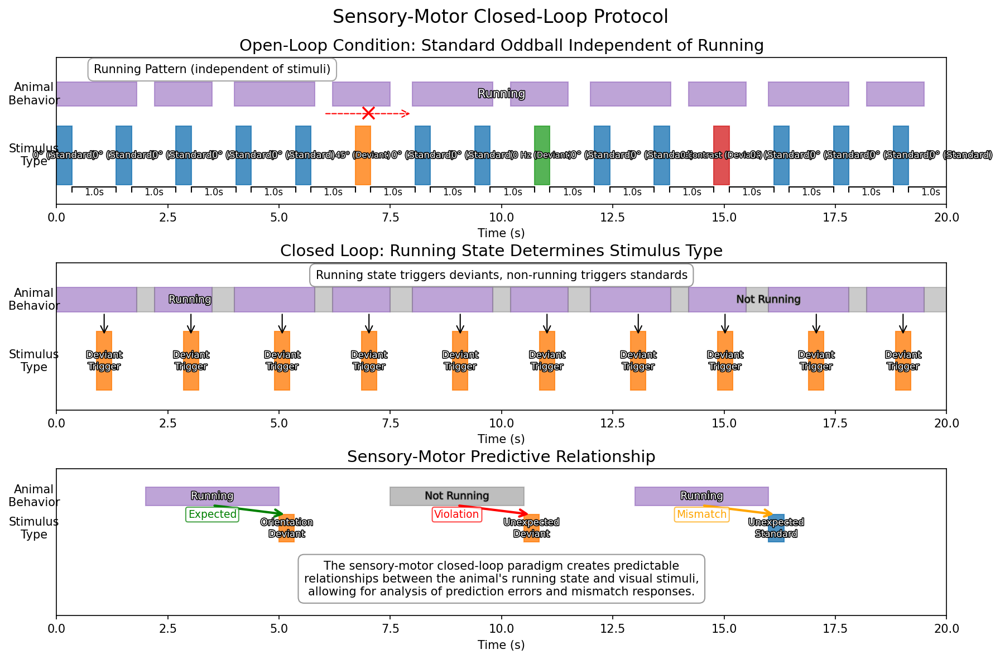

# Sensory-Motor Closed-Loop Stimulus

## Overview

The Sensory-Motor Closed-Loop stimulus provides a visual environment where the movement of the mouse (via a running wheel) directly controls the phase of drifting gratings. This creates a closed sensorimotor loop that allows investigation of how neural responses are modulated by self-generated visual feedback. In the oddball variant, the relationship between wheel movement and visual feedback is occasionally broken, creating sensorimotor prediction errors.

## Stimulus Structure

The figure above illustrates the three key aspects of the sensory-motor closed-loop protocol:

1. **Open-Loop Condition**: Shows how standard oddball stimuli and animal running behavior are independent in traditional paradigms.

2. **Closed-Loop Condition**: Demonstrates how the animal's running behavior directly determines the stimulus type:
   - Running triggers orientation deviant stimuli
   - Non-running periods trigger standard stimuli

3. **Predictive Relationships**: Illustrates the three critical conditions for studying predictive processing:
   - Expected: Running followed by orientation deviant (predicted relationship maintained)
   - Violation: Non-running followed by orientation deviant (unexpected stimulus)
   - Mismatch: Running followed by standard stimulus (expected stimulus omitted)

The sensory-motor closed-loop creates a predictable relationship that can be violated to study prediction error signals.

## Script Location

The stimulus script is located at:
- [`/code/stimulus-control/src/Sensory_motor_oddball_slap2.bonsai`](https://github.com/allenneuraldynamics/openscope-community-predictive-processing/blob/main/code/stimulus-control/src/Sensory_motor_oddball_slap2.bonsai) - Closed-loop implementation with oddball functionality

## Hardware Requirements

- SLAP2 imaging system
- Behavior device with encoder/wheel for tracking animal movement
- Running wheel connected to an encoder on Port 2

## Stimulus Parameters

### Basic Parameters
- **Display Type**: Drifting gratings
- **Spatial Frequency**: 0.04 cycles per degree
- **Temporal Frequency**: 0 Hz (static, since motion is controlled by the wheel)
- **Contrast**: 1.0 (full contrast)
- **Size**: 90° (covering a large portion of the visual field)
- **Aperture**: 90°
- **Angle**: 0° (horizontal grating)

### Oddball Parameters
- **Oddball Frequency**: Random intervals, controlled by experiment duration and number of oddballs
- **Oddball Duration**: Configurable, default is ~1 second per event
- **Total Oddballs**: Configurable, default is 5 per session
- **Oddball Type**: Orientation change (0° → 45° during oddball events)

## Experimental Design

### Closed-Loop Sensorimotor Integration
The core of this experiment is the direct coupling between:

1. **Mouse Movement**: Rotary encoder on Port 2 tracks the animal's wheel running
2. **Visual Feedback**: Encoder data is used to update the phase of the visual gratings in real-time

This creates a predictable relationship where:
- Forward wheel movement → Forward grating motion
- Backward wheel movement → Backward grating motion
- Stationary → Static grating

The script implements this coupling by:
- Reading encoder values from the behavior device
- Dividing encoder values by 300 to create an appropriate scaling factor
- Using the modulus of 360 to convert the wheel position to grating phase
- Applying this calculated phase to the gratings in real-time

### Oddball Implementation

The oddball implementation introduces brief violations of the sensorimotor contingency:

1. **Random Timing**: Oddballs occur at unpredictable intervals throughout the session
2. **Brief Duration**: Each oddball lasts for a configurable duration (default ~1 second)
3. **Orientation Change**: During an oddball, the grating orientation changes from 0° to 45°
4. **Limited Quantity**: A configurable number of oddballs (default 5) occur per session
5. **Layer Priority**: Oddball gratings are displayed on a higher layer (Layer 1) than the standard gratings (Layer 0)

The oddball generator uses frame permutation for randomization and implements a detection system to display the oddball stimulus when the current frame matches one of the predefined oddball frames.

## Technical Implementation
- Encoder values are acquired at high frequency and published to a subject called "Encoder"
- The DrawGratings workflow subscribes to this encoder data
- Real-time mapping applies encoder position to grating phase
- The temporal frequency parameter is set to 0 Hz as the movement is controlled by the wheel

## Data Collection

- Running data is collected via an encoder on Port 2 of the behavior device

## Synchronization
- SLAP2 recording is automatically started and stopped during the experiment
- The experiment can be controlled via spacebar (start) and End key (stop)

## Running the Experiment
1. Start the Bonsai workflow
2. Press the spacebar to begin the experiment
3. The mouse can then control the gratings by running on the wheel
4. In the oddball variant, brief sensorimotor mismatches will occur automatically
5. The experiment can be terminated with the End key

## Related Documents

- **[Bonsai Instructions](bonsai_instructions.md)**: Setup and deployment of Bonsai code
- **[Experimental Plan](../experimental-plan.md)**: Overview of all experimental paradigms
- **[SLAP2 Hardware](../hardware/allen_institute_slap2_hardware.md)**: Details about the SLAP2 imaging system
- **[Standard Oddball](standard-oddball.md)**: Information about the related standard oddball paradigm
